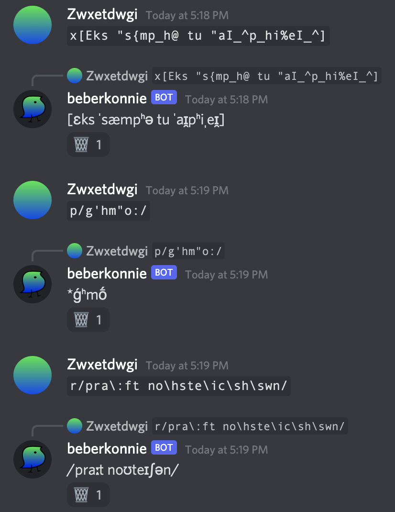

# conniebot

![discord] ![issues]

really cool language bot

## what do

it does various cool language things. currently:

- xsampa, zsampa, and arpabet to ipa (try it out with `x[Eks "s{mp_h@ tu "aI_^p_hi%eI_^]`)
- fun ascii pie and psem notation (try it out with `p/g'hm"o:/`)
- praat's phonetic notation (try it out with `r/pra\:ft no\hste\ic\sh\swn/`)

lookie:



## setup

Note: `master` is the live branch; all active development will take place on `dev`.

### pre flight checklist

#### on the discord website

- do the [application setup] and all that stuff
- set up [oauth] or let it run loose

#### here in ground control

- download and install [node] if you haven't already
- set up `default.yaml` using your bot token ([example config])
- maybe look at the other settings?

### deployment

- run `npm install`, or `npm install --production` or `npm ci --only=production`
  if you're not planning on doing any code changes
- run `npm start`, or `npm run forever` for production; see [pm2 docs] for
  further configuration options
  - due to the fact `npx` prefers system commands, if you want to add config to
    the process (eg log rotation) you should install pm2 globally beforehand.
    how convenient for you!
- pray to whatever god that it doesn't nuke your computer

#### build script opts

```
usage: node build [-hsfn] [--no-install]

conniebot build script.

-h, --help      print out this message and quit.
-s, --start     watch files for development using nodemon.
-f, --forever   run conniebot in production using pm2 (open source version).
-n, --name      process name if running in forever mode. (default: conniebot)
--no-install    pass `--no` to npx, so you don't waste time installing nodemon
                or pm2.
```

### community

discord support server: https://discord.gg/qgCG67knvs  
bots.gg page: https://discord.bots.gg/bots/911674351248613426

[discord]: https://img.shields.io/discord/912393365541224479
[issues]: https://img.shields.io/github/issues/xsduan/conniebot
[application setup]: https://github.com/reactiflux/discord-irc/wiki/Creating-a-discord-bot-&-getting-a-token
[oauth]: https://discordapp.com/developers/tools/oauth2-url-generator
[node]: https://nodejs.org/
[example config]: ./config/default-example.yaml
[pm2 docs]: https://pm2.io/doc/
